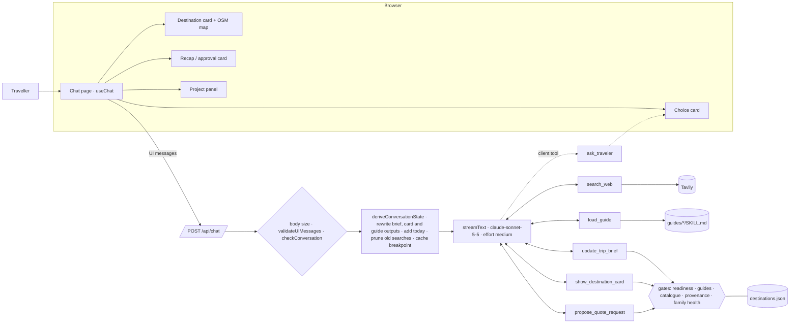
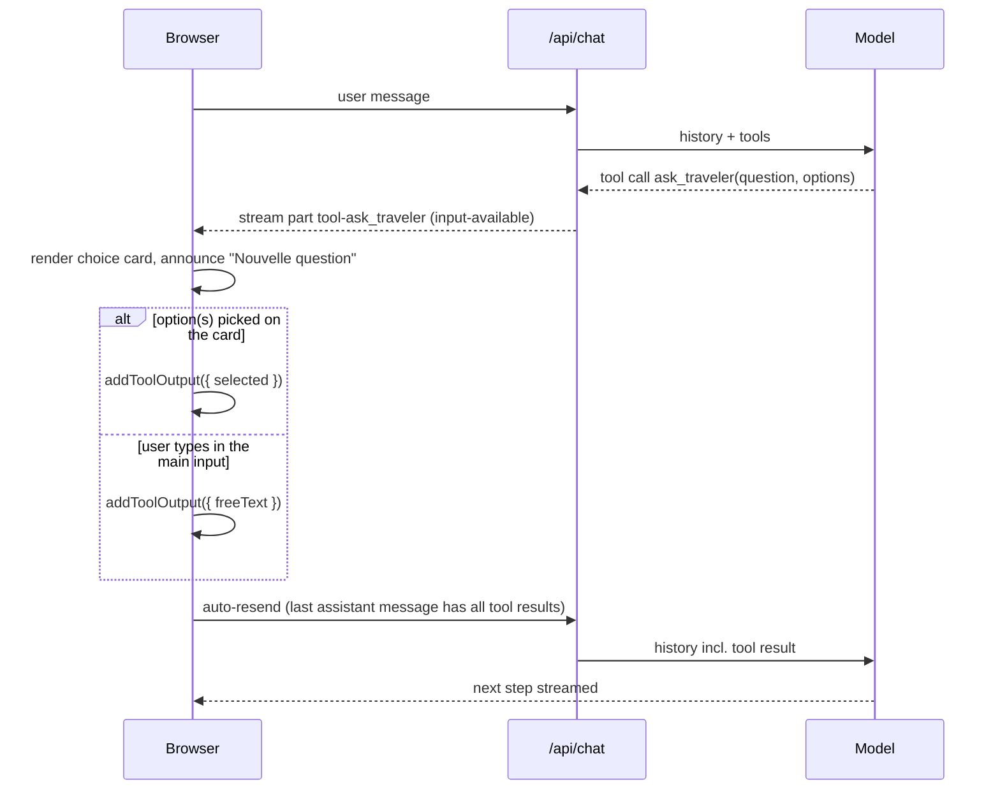
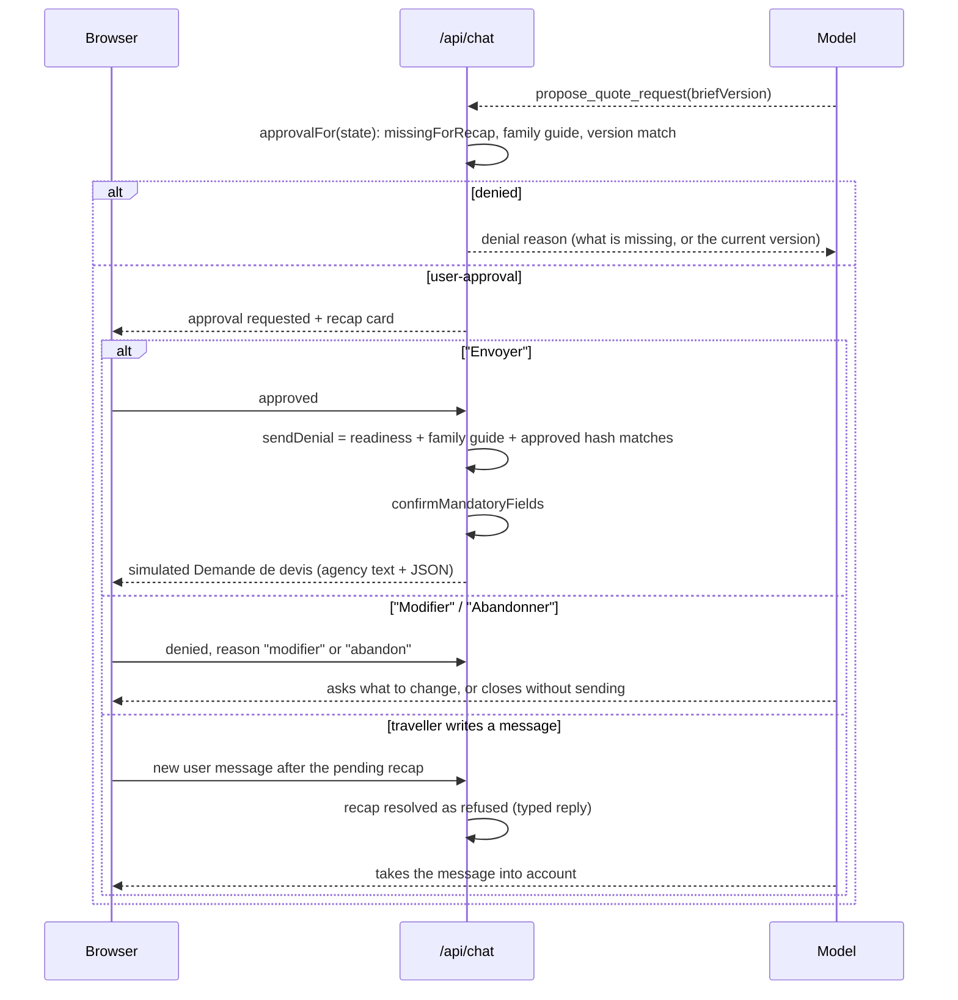

# Architecture

This document describes the system as built. Design rationale lives in
[`docs/specs/2026-09-17-trip-brief-agent-design.md`](specs/2026-09-17-trip-brief-agent-design.md);
the decisions behind each major choice are in [`docs/adr/`](adr/).

## Pattern

Hybrid. An undecided traveller follows no fixed path, so the model chooses its next action turn
by turn, and the core is an agentic loop: `streamText` runs up to 10 steps, and at each step the model answers, asks a choice
question, searches, loads a guide, updates the brief or proposes the recap. The loop stops on the
step cap, and the turn that sends an approved Demande de devis does not enter it at all. Around it,
everything that must not depend on the model's judgement is a deterministic gate in code:

- brief readiness (`missingForRecap` / `isReadyForRecap`),
- guide prerequisites (`responsible_travel` before a destination card, `family_travel` when family
  signals exist),
- catalogue coverage (destination ids are a zod enum built from the catalogue),
- source provenance (a card's sources must come from a `search_web` result in this conversation),
- family health check (for a family, a card needs a successful `search_web` with topic
  `health_formalities` whose query names that destination),
- sending (`sendDenial` = readiness, the family guide, and an approval that names the current
  brief hash).

The model can be wrong about any of these and the gate still holds: the tool returns a structured
error saying what to do instead, and the model recovers from it inside the same turn. No step is
forced onto a tool: when to fetch a guide or run a search is left to the agent, so the prompt, `requiredGuide` and the refusal messages guide it, and the gates are the guarantee.

## Deployment shape

One Next.js 16 App Router application that runs as a single unit: the chat UI is a client
component and the agent runs in the `POST /api/chat` route handler (`maxDuration = 120`). There
is no database and no server-side session. Reloading the page clears the conversation.

The app runs locally from the repository, not hosted; what that costs in
exposure is in the threat model below.

## Request lifecycle

Every turn sends the whole UI message history. `POST /api/chat` processes it in this order:

1. **Body parse** — the raw body is rejected above 200,000 characters (`413 payload_too_large`),
   then parsed as JSON and shaped by zod as `{ messages: unknown[] }` (`400 invalid_body`).
2. **`validateUIMessages`** — validates every tool part's **input** against that tool's
   `inputSchema`, and its **output** only for a tool that declares an `outputSchema`, which
   `ask_traveler`, `search_web`, `show_destination_card` and `propose_quote_request` do. A
   `TypeValidationError` or `InvalidArgumentError` becomes `400 invalid_messages`; anything else is
   rethrown. A tool part it cannot attribute to a declared tool — an unknown tool name, or an empty
   input that fails the `inputSchema` — is not rejected but rewritten as a `dynamic-tool` part
   carrying its unchecked output, which step 3 catches.
3. **`checkConversation`** — an allowlist over the parts a message may carry: `text`, `step-start`
   and `tool-*`, which is everything the app emits. A `file` part, a `data-*` part or the
   `dynamic-tool` part of step 2 is rejected, none of them being `tool-*`. The four outcomes are
   returned verbatim as the wire error: `400 system_message` for a client-sent `system` message,
   `400 unexpected_part` for any other part type, `413 too_many_messages` above 80 messages and
   `413 message_too_long` for a user text part longer than 2,000 characters.
4. **`deriveConversationState`** — rebuilds `{ brief, loadedGuides, searchUrls, healthSearches }`
   by replaying the **inputs** of `update_trip_brief` and `load_guide`, the URLs carried by
   client-sent `search_web` outputs and the queries of the successful `health_formalities` ones
   (through `recordSearch`, which the live tool calls too; a search counts from the next
   `step-start` part or the end of its message, as live, where a step's tool calls run together
   and a card called alongside its health search is refused), and the recap promotion (`applySend`) of every successful `propose_quote_request`
   output — the one client-sent output that moves the brief rather than the sets beside it. This
   state is what the gates read.
5. **The closing turn** — when the last assistant message carries an approved
   `propose_quote_request`, `sendQuoteRequest` applies the same gate and the same promotion the
   tool's `execute` does, and a successful send is streamed on its own: the tool output, no model
   call, no text. The AI SDK executes an approved tool call before the first step and then always
   calls the model once, so no `stopWhen` can end a turn that has not begun. The sent card says
   what happens next, and the sentence the model wrote after it introduced a demande that was
   already gone. A refused approval, or a version the gate denies, falls through to the steps
   below, where the model answers the traveller.
6. **`prepareModelMessages`** — rewrites the history the model will see: every historical
   `update_trip_brief` output is recomputed from its input (an invalid patch becomes a `validation`
   tool failure), every `show_destination_card` output is rebuilt from its input against the
   replayed state, the first `load_guide` output for each guide is re-read from disk and any repeat
   of the same guide becomes a `business` tool failure, today's date is appended to the first user
   message, `convertToModelMessages` produces model messages, `pruneMessages` drops `search_web`
   calls and results older than the last six messages, and an `ephemeral` `cacheControl` breakpoint
   is set on the last message.
7. **`streamText`** — `claude-sonnet-5-5`, `effort: "medium"`, `fallbacks: "default"`, the cached system prompt as
   `instructions`, the six tools, `toolApproval` on `propose_quote_request`,
   `stopWhen: isStepCount(10)`, and `prepareStep` forcing `toolChoice: "none"` on the last step so
   the cap ends in a French sentence rather than a truncated tool call. `onError` logs the error
   name and, for an `APICallError`, the status code only — never conversation content.
8. **`toUIMessageStream` / `createUIMessageStreamResponse`** — streams typed UI parts back. A 429
   or 529 is mapped to "Le service est très sollicité. Réessayez dans un instant.", anything else
   to a generic French message; the client only renders messages from that known list.

Two cache breakpoints are used: one on the system prompt, one on the last message. Today's date
goes into the first user turn rather than the system prompt: keeping it out of the prompt means the
prompt caches across days, and pinning it to the first turn means the history prefix is byte
identical from one turn to the next, which is what the five-minute ephemeral entry actually needs.
Pruning still truncates the reusable prefix once the oldest `search_web` call leaves the
six-message window.

## Client round trips

`ask_traveler` has no `execute`: it is answered in the browser. The client sends automatically
when the last assistant message is complete with tool results or with approval responses
(`lastAssistantMessageIsCompleteWithToolCalls`, `lastAssistantMessageIsCompleteWithApprovalResponses`),
except when that message carries a sent brief: the send closes the conversation, so
`shouldSendAutomatically` stops there rather than asking the model to comment on it.

If the model opens more than one question in a step, only the first is answered; the others are
closed with the error output "Une seule question à la fois."

The recap is the only approval point. `propose_quote_request` is gated twice: the approval
callback decides whether the traveller is even asked, and `sendQuoteRequest` re-checks before
sending, from the tool's `execute` or from the closing turn. A successful send ends the turn there.

The traveller can also write instead of clicking. The AI SDK rejects a tool call left without a
result before the next user message (`MissingToolResultsError`), so `prepareModelMessages` resolves
every recap still awaiting approval before the last message as refused, with a reason telling the
model to take the message into account. On the client, only the last message's recap keeps its
buttons (`pendingApproval`); an earlier one says it was not sent.

## Tools

Six tools, each mapping to one capability of the agent. The count is deliberate: the
Claude Certified Architect exam guide (Foundations, task 2.3) warns that too many tools degrade
selection (18 tools versus 4–5 in its example). Every description states the input format, when to
use the tool and when not to. Inputs are validated with zod on the server even under strict tool
use, because strict JSON Schema does not support `minimum`/`maximum`/`minLength`/`maxLength` and
limits `minItems` to 0 or 1
([structured outputs](https://platform.claude.com/docs/en/build-with-claude/structured-outputs)).
Expected failures return `{ ok: false, error: { errorCategory, isRetryable, message } }` with
`errorCategory` in `validation | transient | business`; only `transient` is retryable. Parallel
tool calls stay enabled, so a guide load and a search can run in the same step.

| Tool                     | Runs                        | Contract                                                                                                                                                                                                                                                                      |
| ------------------------ | --------------------------- | ----------------------------------------------------------------------------------------------------------------------------------------------------------------------------------------------------------------------------------------------------------------------------|
| `ask_traveler`           | client (no `execute`)       | `question`, `options` (2–6, `{ id, label, description? }`), `multiSelect`; output `{ selected: id[] }` or `{ freeText }`. Free text through the main input always answers the pending question.                                                                                 |
| `search_web`             | server                      | `query`, `topic: "general" \| "health_formalities"`. Tavily, `searchDepth: "basic"`, timeout 8 s, at most 5 results, snippets truncated to 400 characters; `health_formalities` restricts results to `diplomatie.gouv.fr`, `pasteur.fr`, `who.int`. An empty list is a valid result; a failure is `transient`. |
| `show_destination_card`  | server                      | `destinationId` (catalogue enum), `region`, `why`, `bestPeriod`, `highlights[]`, `alerts[]`, `sources[{ title, url }]`, `coordinates`, `flightTimeFromParis` — `region` and `flightTimeFromParis` are required, two cards of a turn being aligned row by row on them. Gates: `responsible_travel` loaded, `family_travel` loaded when family signals exist (`business` errors), every source URL seen in a `search_web` result (`validation` error), and, when family signals exist, a successful `health_formalities` search whose query names the destination — its label or the label with spaces and hyphens removed (« Vietnam » for « Viêt Nam »), compared after folding case, accents and punctuation, as whole words (`business` error naming the search to run). An unknown destination id fails input validation. |
| `load_guide`             | server                      | `guide: "family_travel" \| "responsible_travel"` → the guide body read from `guides/<name>/SKILL.md`, frontmatter stripped.                                                                                                                                                          |
| `update_trip_brief`      | server                      | A partial patch → `{ ok: true, brief, version, missingForRecap[], requiredGuide? }`. `requiredGuide` is returned when family signals exist without the family guide.                                                                                                           |
| `propose_quote_request`  | server, behind tool approval| `briefVersion` (16 hex characters). The approval callback denies with the missing items, or "Chargez d'abord le guide family_travel", or the current version when the hash is stale; otherwise the recap card is shown. `execute` re-runs the same `sendDenial` gate, promotes the mandatory fields to `confirmed` in the returned brief and returns it with the agency-readable text. |

### Guides

`load_guide` carries its own trigger rules in its description: `family_travel` as soon as
children, `partyType` family or a family trip are mentioned; `responsible_travel` before recommending a
destination or when the traveller asks for something more responsible. The prerequisites are then
enforced server-side against the replayed state, so a missed trigger produces a business error
instead of an ungrounded recommendation.

A guide is loaded once, enters the conversation as a tool result and stays there. The system
prompt never contains guide text — a unit test asserts it. The interface does not say which guide
was loaded ([0007](adr/0007-no-internals-in-the-interface.md)); the tests, the gate and the
status line show it. `tests/agent/trajectories.test.ts` asserts that a family
brief is denied and a destination card refused until `family_travel` is loaded, that the same
send goes through once it is, and that a model which records a family and loads the guide on its
own reaches the send with no step forced;
`tests/agent/tools.test.ts` asserts that `update_trip_brief` returns `requiredGuide` on a family
signal. The gate in `buildDestinationCard` (`lib/agent/tools.ts`) makes a card impossible without
`responsible_travel` and, once family signals are recorded, without `family_travel` or without a health
search naming the destination: the family guide asks for health to be verified before a
destination is recommended, and text the model reads after loading it is followed only some of
the time. While the guide
loads, the traveller sees the status line "Consultation des conseils famille".

`guides/family_travel/SKILL.md` covers tone, what to ask or check for children (ages, rhythm,
health, accommodation, meals), the signals to raise and the defaults.
`guides/responsible_travel/SKILL.md` lists the levers a recommendation can use (off-season, less
crowded regions, longer stays, closer destinations, local transport, the local agency, meeting
residents, respect) and the phrasing rules. Both are written for this project.

### Destination catalogue

`data/destinations.json` holds the 249 ISO 3166-1 alpha-2 codes with their French names from
Unicode CLDR 48.2.2 (`cldr-core/supplemental/codeMappings.json` and
`cldr-localenames-full/main/fr/territories.json`), generated by `scripts/extract_destinations.py`:
`id` is the code (`VN`), `label` the CLDR name (« Viêt Nam »). CLDR's own groupings (`EU`, `ZZ`,
`XK`…) sit at numeric codes 900 and above and are left out. `destinationIdSchema` is a zod enum
over those ids, so an off-catalogue
destination cannot enter a brief or a card at all. When the traveller wants one, the agent says
plainly that no local agency covers it and proposes two or three nearby catalogue destinations.

## Brief state

The brief is never stored. It is recomputed on every request from the `update_trip_brief` inputs
in the history, then re-validated by `tripBriefSchema`. Each tracked field is
`{ value, status: "confirmed" | "inferred", evidence?, note? }`; an absent field is unknown.
`mergeBrief` is a pure function: a patch replaces a scalar or a whole array, `null` clears a field,
a field named in `resolves` replaces its value and closes the matching contradiction, and a
`confirmed` value replaced without `resolves` opens a contradiction instead of overwriting.
`confirmMandatoryFields` promotes destination, dates, duration and travellers to `confirmed` when
the recap is approved.

`briefVersion` is the first 16 hex characters of the SHA-256 of the serialised brief;
`JSON.stringify` is stable here because every brief comes out of `tripBriefSchema.parse`, which
emits keys in schema order. That hash is what the approval names, so approving a recap cannot send
a brief that has changed since. It is not shown to the traveller: the recap card is where the brief
an approval is bound to is reviewed, field by field.

The full field model and the merge rules are in the spec, §5.

## Threat model

The route is stateless and receives the whole history from the browser, so the client is
untrusted.

- `validateUIMessages` checks every tool part's input against its tool's `inputSchema`. It checks
  an output only where the tool declares an `outputSchema`: four of the six do — `ask_traveler`,
  `search_web`, `show_destination_card` and `propose_quote_request` — so a forged `search_web`
  output is a `400` rather than something the route walks. The two that declare none,
  `update_trip_brief` and `load_guide`, have their outputs replaced before the model call (below),
  as does `show_destination_card`. That leaves `propose_quote_request`: its output is shaped by a
  schema but not recomputed, and the server reads it — a `{ ok: true }` one makes both
  `deriveConversationState` and the replay run `applySend`, which promotes destination, dates,
  duration and travellers to `confirmed` as an approved recap does. The residual below covers what
  that is worth to the client sending it.
- The brief is recomputed from `update_trip_brief` **inputs**; client-sent outputs of that tool
  never reach the model — `prepareModelMessages` overwrites them with the recomputed value.
- `load_guide` outputs are re-read from disk by guide name before the model call, so the body of a
  client-sent `tool-load_guide` part never reaches the model. A guide is read once per
  conversation: repeats become a tool failure, so a handcrafted history cannot multiply one guide
  file into megabytes of context. That replay matches on the `tool-load_guide` part type, so it
  would miss the `dynamic-tool` part `validateUIMessages` produces for a tool part it cannot
  attribute to a declared tool, whose output no schema checks either; `checkConversation` rejects
  any `dynamic-tool` part with a `400`. The app declares all six of its tools, so such a part can
  only come from a forged or stale history.
- Destination card and feasibility alert sources are checked against the `search_web` outputs of
  the same conversation. Those outputs come from the client, so a forged search result
  makes a card cite a forged URL — inside that client's own session (see the residual below).
- Sending is simulated and gated server-side by one function, `sendDenial`, called both by the
  approval callback and by `execute`, so the two cannot disagree. Tool
  approval is used without the experimental signing secret precisely because the server re-checks
  readiness and the brief hash.
- Caps: 200,000-character body, 2,000-character user message, 80 messages, 10 steps per turn
  (sized for a guide load plus three searches and three cards). Reaching the step cap ends the turn
  with a French sentence, not a raw error.
- Web results are data, never instructions — stated in the system prompt and never given the
  ability to change a gate.
- No tool has an external side effect. The only "action" is the simulated send, behind human
  approval.
- **Residual, by design.** Recomputing from inputs stops forged outputs, not a forged history.
  `deriveConversationState` replays any `update_trip_brief` input present in the history without
  checking that the assistant emitted it, and `tripBriefPatchSchema` accepts
  `status: "confirmed"`, so a handcrafted history can set the mandatory fields itself, empty
  `missingForRecap` and reach an approved send; the same applies to `loadedGuides`,
  `searchUrls`, `healthSearches` — a forged `health_formalities` search keeps its own family card
  past the health gate, which holds the model, not a client forging its own history — and to the
  `propose_quote_request` output whose presence replays the recap
  promotion. `search_web` outputs are not replayed — re-running the searches would cost a
  Tavily call per historical search on every turn — so a handcrafted snippet reaches the model
  verbatim, the same injection channel a forged guide body would be if it were not re-read.
  Nothing is persisted and the send is simulated, so the blast radius is the session's own client.
  The answer is server-side persistence per `chatId` accepting only the latest message
  (spec §15, P1), which makes the history the server's rather than the client's.

- In the browser: a Content Security Policy (`next.config.ts`) limits images to `'self' data:` and
  frames to `https://www.openstreetmap.org`, forbids framing the app, and is served with
  `X-Content-Type-Options: nosniff`; `<Streamdown disallowedElements={["img"]}>` drops markdown
  images outright, so an injected image URL cannot become a request; and the map iframe runs with
  `sandbox="allow-scripts"` and `referrerPolicy="no-referrer"`.

The route authenticates nobody and has no per-IP rate limiting: it is meant to be run locally,
and the Anthropic workspace spend limit is the backstop. `pnpm dev` and `pnpm start` both bind to
`127.0.0.1` for that reason — `next dev` and `next start` otherwise listen on `0.0.0.0`
([Next.js CLI](https://nextjs.org/docs/app/api-reference/cli/next)), which would leave
`/api/chat` open to the local network. Hosting it would need an access control and a rate limit
added first, both in the README's next steps.

## Privacy

The agent asks for no identity data, but a traveller may volunteer health or mobility information,
which is special-category data. The interface carries no notice about it: the README states that
nothing is sent, that a reload ends the conversation and that messages reach the model and the
search provider, this being a prototype run locally rather than a service anyone signs up to.
No conversation is logged or sent anywhere other than the model and
search providers; there is no analytics, no tracker and no tracing in the application. The
agency-readable text carries only what the agency needs. Model inference runs on Anthropic's
first-party API with `global` processing; EU inference is a production requirement, not a property
of this prototype. Tracing requirements for production — EU region, masking of `evidence`,
`constraints` and `projectSummary`, short retention — are in
[`docs/observability.md`](observability.md).

## Testing

Vitest covers the domain logic (schema, merge rules, both gates, catalogue, agency text), every
server tool and each of its gates with Tavily mocked, the conversation state and its pruning, the
route's body limits, and the streaming handler driven by `MockLanguageModelV4` from `ai/test`. The
item-by-item list is §13 of the
[spec](specs/2026-09-17-trip-brief-agent-design.md). CI runs lint, format check, typecheck, tests
and build on every push and pull request.
